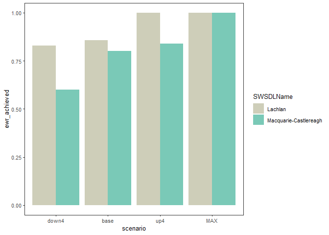

<!-- README.md is generated from README.Rmd. Please edit that file -->

# HydroBOT

<!-- badges: start -->

[](https://github.com/galenholt/HydroBOT/actions/workflows/R-CMD-check.yaml)
\[

<!-- badges: end -->

This R package (HydroBOT) forms the core of the climate adaptation
toolkit developed for the [climate adaptation
theme](https://www.mdba.gov.au/climate-and-river-health/murray-darling-water-and-environment-research-program/climate-adaptation)
of the [*Murray–Darling Water and Environment Research
Program*](https://www.mdba.gov.au/climate-and-river-health/murray-darling-water-and-environment-research-program)*.*
HydroBOT ingests hydrological scenarios representing historical or
future climates or adaptation options, and processing those through
various response models (currently [MDBA EWR
tool](https://github.com/MDBAuth/EWR_tool), with intention to include
other tools in future). Subsequent processing of outcomes along spatial,
theme, and temporal axes are available, as well as control over outputs
and comparisons between scenarios. Causal networks defining
relationships in the response models are included, though in general the
current versions should be obtained from the EWR tool directly with
`get_causal_ewr()`.

<div id="doc_site" style="color: red">

***See the [documentation
website](https://mdbauth.github.io/HydroBOT_website/) for more
installation instructions and examples.***

</div>

There is a [template repo](https://github.com/MDBAuth/toolkit_use)
available (contact authors) that can sometimes be helpful for
establishing project structure to use the HydroBOT and automating the
setup process, particularly if you are on Linux or want to manage your
python environments. It is mostly useful for specific cases, e.g. Azure
at MDBA or HPCs. In normal use, [start
here](https://mdbauth.github.io/HydroBOT_website/getting_started.html)

## Installation

Install the development version of HydroBOT from
[GitHub](https://github.com/galenholt/HydroBOT) with your favorite
installer

``` r
# install.packages("devtools")
devtools::install_github("galenholt/HydroBOT.git")
```

``` r
library(HydroBOT)
#> Loading required package: sf
#> Linking to GEOS 3.13.0, GDAL 3.10.1, PROJ 9.5.1; sf_use_s2() is TRUE
```

<div id="py-install" style="color: gray">

### Python dependency

To run the current built in EWR module, HydroBOT needs a Python
environment containing `py_ewr` (currently 2.3.7). The package will
manage that for you if you just start using it- on first use, the
package checks the environment and either uses an existing python
environment or builds one with that dependency when the package is
loaded.

There are `poetry.lock` and `pyproject.toml` files in the repo that
allow for dev work and building the venv manually if more control over
python is desired.

</div>

## Use

HydroBOT can be run piecemeal or all at once, scripted. Point it at a
directory of hydrologic scenarios, and HydroBOT will run them through
the modules, aggregate the outputs, and present results, with control by
the user through function arguments. Each stage builds a runnable set of
parameter metadata based on function arguments for tracking provenance
and reproducibility. Typical approaches use R scripts, Quarto notebooks,
or automation on HPC or azure systems with yaml parameter files and
shell/R scripts.

See the [HydroBOT documentation
website](https://mdbauth.github.io/HydroBOT_website/) for a full
demonstration.

Using HydroBOT is typically a three-step process:

1.  Running hydrographs through the EWR tool (or future modules) with
    `prep_run_save_ewrs()`.

    - Best practice has hydrographs in directories defined by scenarios,
      so all hydrographs within a scenario can be run at once,
      parallelised over scenarios.

2.  Aggregating module outputs to larger theme, spatial, and temporal
    scales with `read_and_agg()`

    - `read_and_agg()` maintains dimensional safety over theme,
      temporal, and spatial dimensions, avoiding the collapse over
      unintended dimensions that is quite easy to miss if manually using
      e.g. `dplyr::summarise()`.

    - `read_and_agg()` (and wrapped functions for dimensional
      aggregation) provide the ability to retain groupings and do
      non-spatial joins of spatial data. This allows them to be
      EWR-aware, and provide warnings and automation for best-practice
      automation of EWR aggregation that does not collapse planning and
      sdl units too soon and join gauges to them non-spatially. The
      easiest way to use this is with `auto_ewr_PU = TRUE` .

    - It is expected that `read_and_agg()` may be run several times for
      a given analysis, with several different aggregation sequences, as
      different sets may be needed for different questions, or iterative
      production of results identifies better approaches.

3.  Developing output products targeting the question of interest
    (typically a scenario comparison) with `plot_outcomes()` and
    `baseline_compare()`

    - `plot_outcomes()` provides consistent processing and analysis of
      input and output data, compared to manually building ggplots

    - `plot_outcomes()` is theme, space, and time-aware, and so prevents
      accidental overplotting or other losses of dimensional data.

    - The return from `plot_outcomes()` is a ggplot object, which can
      then be tweaked as usual.

## Example run

A simple run of HydroBOT with the provided example data works as
follows. See the [documentation
website](https://mdbauth.github.io/HydroBOT_website) for much more
detail.

Any real run should think carefully about the aggregation and plotting
decisions. For much more detail about setting up runs, see the
[documentation](https://https://mdbauth.github.io/HydroBOT_website/workflows/workflow_overview).

The path to the hydrographs

``` r
hydro_dir <- system.file("extdata/testsmall/hydrographs", package = "HydroBOT")
```

Run the EWR tool and return the output to memory, rather than saving for
this small example. See
[documentation](mdbauth.github.io/HydroBOT_website/controller/controller_overview)
for more details

``` r
ewr_out <- prep_run_save_ewrs(
  hydro_dir = hydro_dir,
  output_parent_dir = tempdir(),
  outputType = list("none"),
  returnType = list("yearly")
)
```

Set up the aggregation steps, see
[documentation](https://mdbauth.github.io/HydroBOT_website/aggregator/aggregation_overview)
for more detail.

``` r
aggseq <- list(
  all_time = "all_time",
  ewr_code = c("ewr_code_timing", "ewr_code"),
  env_obj = c("ewr_code", "env_obj"),
  sdl_units = sdl_units,
  Target = c("env_obj", "Target"),
  mdb = basin,
  target_5_year_2024 = c("Target", "target_5_year_2024")
)

funseq <- list(
  all_time = "ArithmeticMean",
  ewr_code = "CompensatingFactor",
  env_obj = "ArithmeticMean",
  sdl_units = "ArithmeticMean",
  Target = "ArithmeticMean",
  mdb = "SpatialWeightedMean",
  target_5_year_2024 = "ArithmeticMean"
)
```

Do the multi-dimensional aggregation, again just returning to memory.

``` r
aggout <- read_and_agg(
  datpath = ewr_out,
  type = "achievement",
  geopath = bom_basin_gauges,
  causalpath = causal_ewr,
  groupers = "scenario",
  aggCols = "ewr_achieved",
  auto_ewr_PU = TRUE,
  aggsequence = aggseq,
  funsequence = funseq,
  saveintermediate = TRUE,
  namehistory = FALSE,
  keepAllPolys = FALSE,
  returnList = TRUE,
  add_max = FALSE
)
```

A couple figures to check it worked, see
[documentation](https://mdbauth.github.io/HydroBOT_website/comparer/comparer_overview)
for more detail.

``` r
map_example <- aggout$Target |>
  # dplyr::filter(env_obj == "NF1") |> # Need to reduce dimensionality
  plot_outcomes(
    outcome_col = "ewr_achieved",
    plot_type = "map",
    colorset = "ewr_achieved",
    pal_list = list("scico::lapaz"),
    pal_direction = -1,
    facet_col = "Target",
    facet_row = "scenario",
    sceneorder = c("down4", "base", "up4"),
    underlay_list = "basin"
  ) +
  ggplot2::theme(legend.position = "bottom")

map_example
```


``` r
catchcompare <- aggout$env_obj |>
  plot_outcomes(
    outcome_col = "ewr_achieved",
    colorset = "SWSDLName",
    pal_list = list("calecopal::lake"),
    sceneorder = c("down4", "base", "up4"),
    position = "dodge"
  )

catchcompare
```



## Development

[See developer page](developer.md)

## Further examples

See the [HydroBOT website](https://mdbauth.github.io/HydroBOT_website/)
for a full demonstration.

## Who do I talk to?

- Galen Holt, <g.holt@deakin.edu.au>

## Acknowledgements

HydroBOT was developed in the [climate adaptation
theme](https://www.mdba.gov.au/climate-and-river-health/murray-darling-water-and-environment-research-program/climate-adaptation)
of the [Murray–Darling Water and Environment Research
Program](https://www.mdba.gov.au/climate-and-river-health/murray-darling-water-and-environment-research-program),
a program of the [Murray-Darling Basin
Authority](https://www.mdba.gov.au/). Collaboration with colleagues from
Deakin University, CSIRO, and the MDBA were essential to its development
and success.
